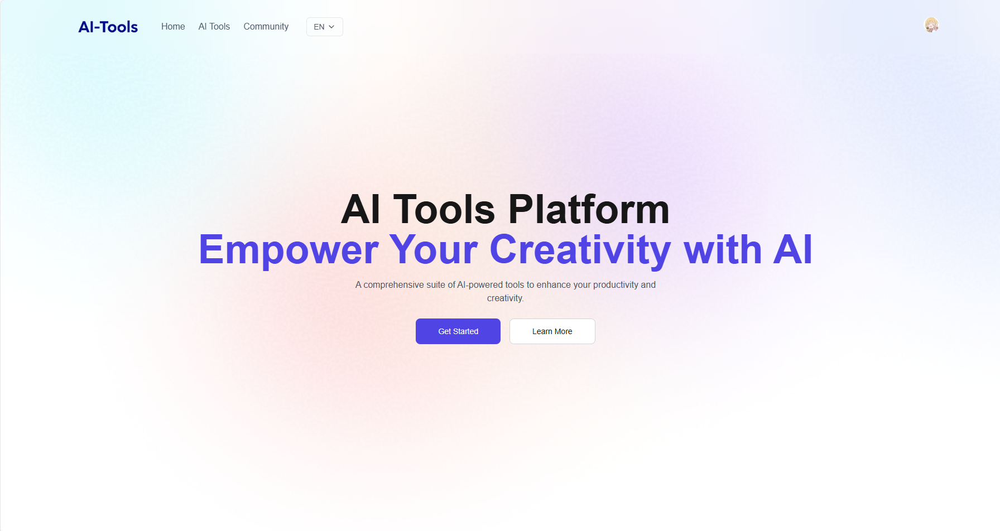
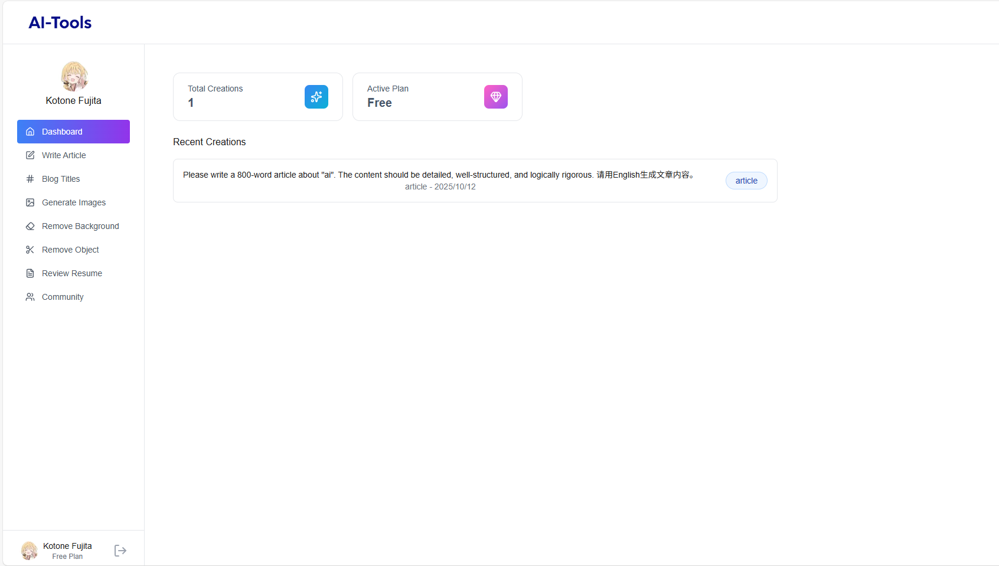

# AI Tools Platform

基于 Next.js 的全栈 AI 工具平台，支持中英文国际化，集成多种 AI 功能模块。

## 🖼️ 项目展示





## ✨ 功能特性

### AI 工具

- **文章写作**：按主题与字数生成文章
- **博客标题生成器**：按主题与分类生成标题
- **AI 图像生成**：根据描述生成图片，并转存到 Cloudinary
- **简历审查**：上传 PDF/MD/DOC(X) 等文件，由 Dify workflow 解析并输出审查建议

### 社区与系统

- **社区分享**：创作内容社区展示与点赞
- **国际化支持**：中英文界面切换，动态语言包加载
- **用户认证**：Clerk 登录与鉴权（免费/高级用户策略由后端控制）
- **数据管理**：创作内容存储、发布/取消发布、删除

## 🛠️ 技术栈

### 前端

- Next.js 15（App Router）
- React 19
- TypeScript
- Tailwind CSS
- @tanstack/react-query
- Clerk（身份认证）

### 后端（EdgeOne Node Functions）

- Express.js
- Neon PostgreSQL（@neondatabase/serverless）
- Dify Workflows API
- Cloudinary（图片托管）

### 工程化

- Biome（format/lint）
- Husky（提交信息规范）

## 📦 快速开始

### 1) 克隆项目

```bash
git clone https://github.com/FunEnn/AITools.git
cd AITools
```

### 2) 安装依赖

```bash
npm install
```

### 3) 环境变量

创建 `.env` 文件（或在 EdgeOne 控制台配置环境变量）：

```env
# Clerk
NEXT_PUBLIC_CLERK_PUBLISHABLE_KEY=...
CLERK_SECRET_KEY=...

# 数据库（Neon Postgres）
DATABASE_URL=...

# Dify
DIFY_API_KEY=...
DIFY_BASE_URL=https://api.dify.ai/v1

# 前端请求后端的 baseURL（可选）
NEXT_PUBLIC_BASE_URL=/express/api

# Cloudinary
CLOUDINARY_CLOUD_NAME=...
CLOUDINARY_API_KEY=...
CLOUDINARY_API_SECRET=...
```

### 4) 启动开发服务器

```bash
# 标准 Next.js 开发（仅前端）
npm run dev
```

如果你需要联调 Node Functions（推荐），使用 EdgeOne Pages 本地开发：

```bash
edgeone pages dev
```

### 5) 构建

```bash
npm run build
npm start
```

## 📝 开发说明

### 核心功能
- **AI 工具模块**: 文章写作、图像生成、背景移除、简历审查
- **社区功能**: 创作分享、点赞互动、公开作品展示
- **用户系统**: 注册登录、权限控制、使用次数管理
- **国际化**: 中英文切换、动态语言包加载

### 部署支持
- 支持 EdgeOne Pages 部署
